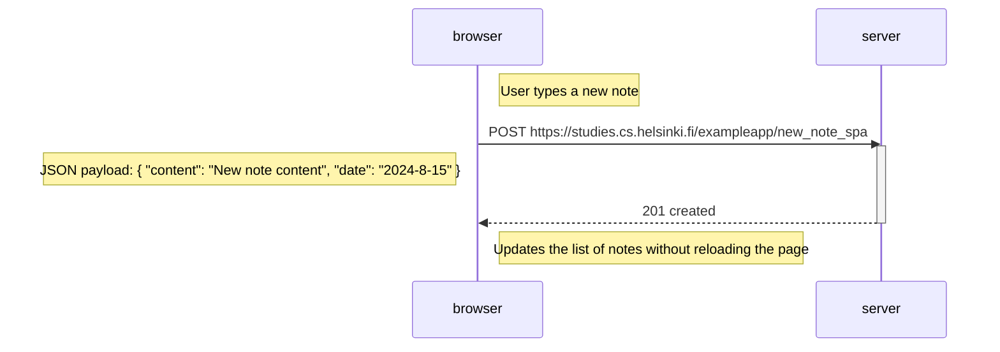

```mermaid
sequenceDiagram
participant browser
participant server

    Note right of browser: User types a new note

    browser->>server: POST https://studies.cs.helsinki.fi/exampleapp/new_note_spa
    activate server
    Note left of browser: JSON payload: { "content": "New note content", "date": "2024-8-15" }
    server-->>browser: 201 created
    deactivate server

    Note right of browser: Updates the list of notes without reloading the page
```
